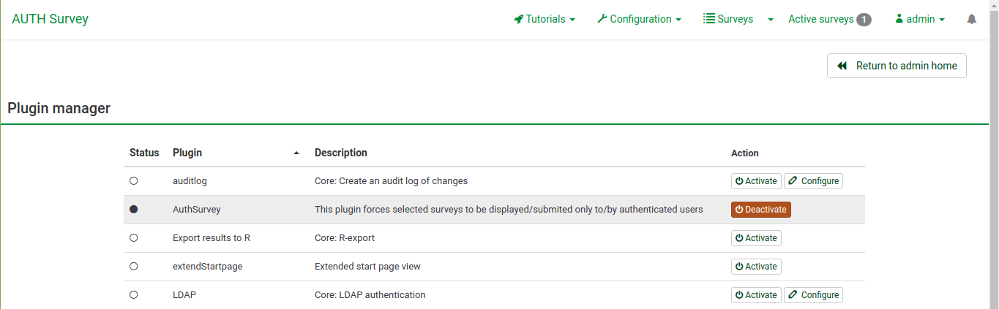
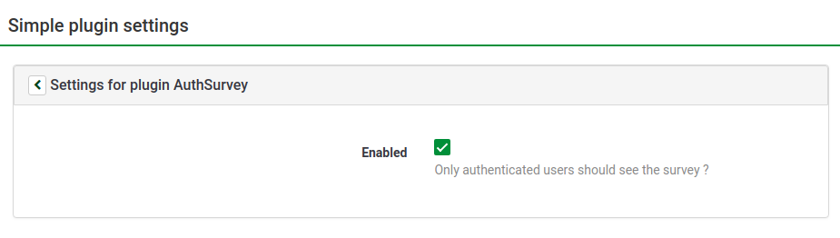
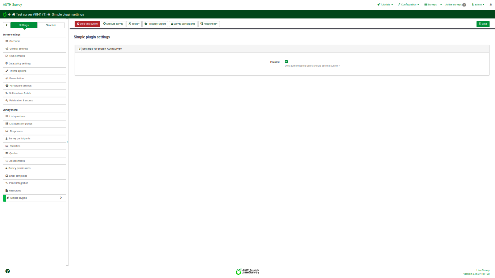
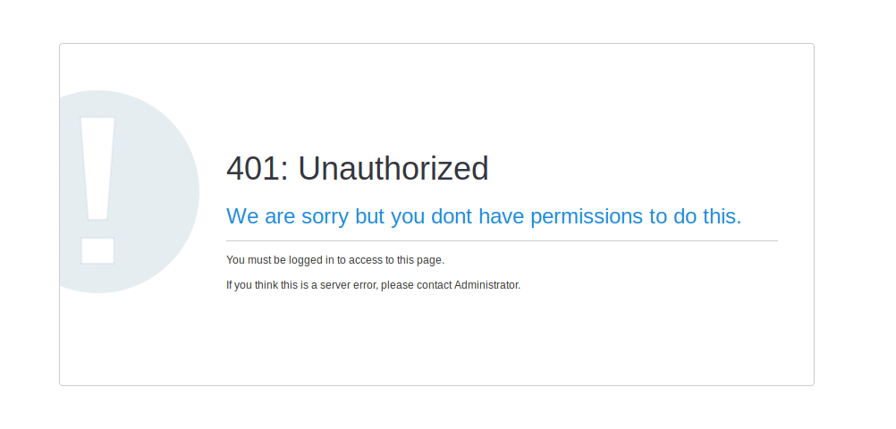

# LimeSurvey Auth Surveys
This plugin allow selected surveys to be displayed/submited only to/by authenticated users.

Every survey can have different configuration/policy.

## Installation instructions

1. Copy **AuthSurvey** folder with its content at **limesurvey/plugins** folder
2. Go to **Admin > Configuration > Plugin Manager** or **https:/example.com/index.php/admin/pluginmanager/sa/index**
and **Enable** the plugin

## How to enable plugin for specific survey
  1. Go to **Surveys > (Select desired survey) > Simple Plugins** or
**https:/example.com/index.php/admin/survey/sa/rendersidemenulink/surveyid/{survey_id}/subaction/plugins**
  2. Open **Settings for plugin AuthSurvey** accordion
  3. Click **Enabled** checkbox
  

## Images for the plugin

This is how the plugin settings look for a specific survey.

This is what an unauthorized user sees when they try to view/submit a survey that is protected by the plugin.

